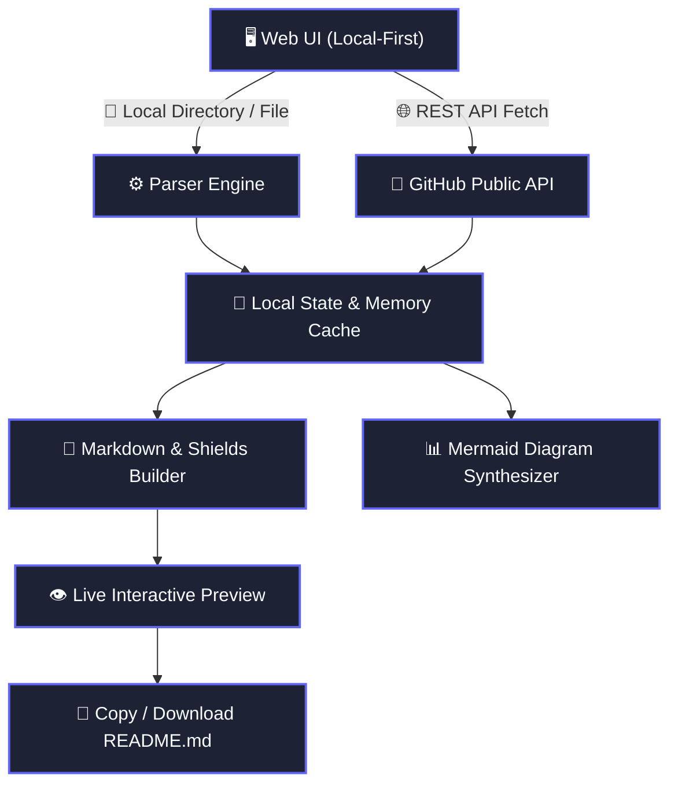

<div align="center">

# RepoHero

**Instant README & Architecture Flowchart Generator for Modern Repos**

[](https://github.com/Mohito-s/RepoHero/stargazers)
[](LICENSE)
[](https://github.com/Mohito-s/RepoHero/issues)
[](https://github.com/Mohito-s/RepoHero/pulls)

<p align="center">
  [Explore Demo](https://mohito-s.github.io/RepoHero/) • [Report Bug](https://github.com/Mohito-s/RepoHero/issues) • [Request Feature](https://github.com/Mohito-s/RepoHero/issues)
</p>

</div>

---

## 📖 Overview

An open-source, local-first engine designed to supercharge developer documentation with instant visual previews, dynamic Shields.io badges, and smart architecture diagrams.

---

## ✨ Features

| Feature | Description |
| :--- | :--- |
| ⚡ **Zero Configuration** | Works right out of the box with intelligent defaults and automated stack detection. |
| 🔒 **100% Local & Private** | Zero servers involved. Your sensitive tokens, code, and logs never leave your device. |
| 🎨 **Rich Visuals & Mermaid** | Automatic architecture flowcharts, sequence diagrams, and interactive badges. |
| 📦 **Multi-Runtime Support** | First-class support for Node, Bun, Python, Rust, Go, and Docker environments. |

---

## 🛠 Tech Stack

   

---

## 🏛 Architecture



---

## 🚀 Quick Start

### Prerequisites
Make sure you have [pnpm](https://www.google.com/search?q=pnpm) installed on your machine.

### Installation

```bash
# 1. Clone the repository
git clone https://github.com/Mohito-s/RepoHero.git

# 2. Enter repository directory
cd RepoHero

# 3. Install project dependencies
pnpm install

# 4. Start local development server
pnpm dev
```

---

## 📋 Changelog

### v1.2.0 (2026-09-28)
- Added live Mermaid.js diagram viewer
- Integrated GitHub public API fetcher
- Added for-the-badge Shields style support

### v1.1.0 (2026-09-15)
- Support for local file drag-and-drop parsing
- Dark / Light theme toggle

### v1.0.0 (2026-09-01)
- Initial release of RepoHero generator

---

## 🤝 Contributing

Contributions, issues and feature requests are welcome!  
Feel free to check [issues page](https://github.com/Mohito-s/RepoHero/issues).

1. Fork the Project
2. Create your Feature Branch (`git checkout -b feature/AmazingFeature`)
3. Commit your Changes (`git commit -m 'Add some AmazingFeature'`)
4. Push to the Branch (`git push origin feature/AmazingFeature`)
5. Open a Pull Request

---

## 📝 License

Distributed under the **MIT License**. See `LICENSE` for more information.

<div align="center">
  <sub>Built with ❤️ using <a href="https://github.com/Mohito-s/RepoHero">RepoHero</a> • Powered by Google Gemini 3.8</sub>
</div>
